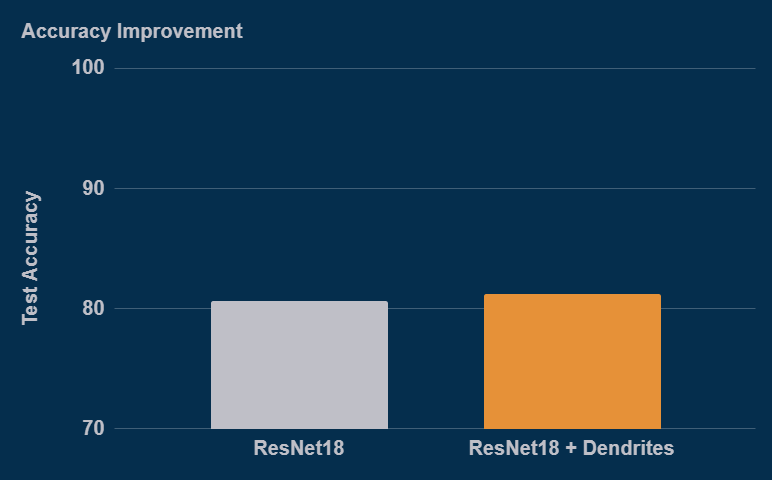
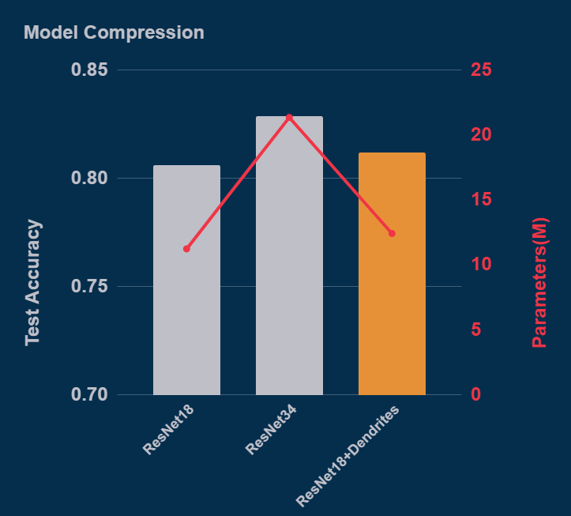
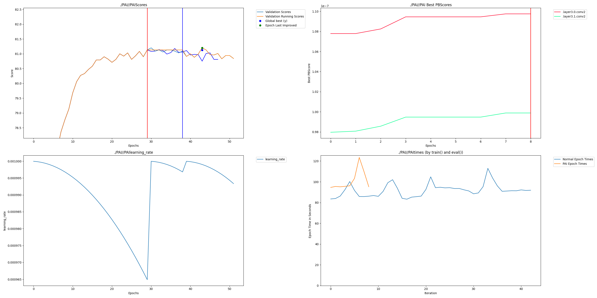

# CIFAR-100 Image Classification with Dendritic Learning

## Intro

### Description
This project investigates whether dendritic learning (Perforated AI) can improve the accuracy–parameter efficiency trade-off of convolutional neural networks on CIFAR-100, a challenging 100-class image classification benchmark.

We apply dendrites to a ResNet-18 backbone and compare its performance against:
1. **ResNet-18 (Baseline)**: The standard architecture.
2. **ResNet-34**: A larger traditional model served as a higher-capacity baseline.
3. **ResNet-18 + Dendrites (PAI)**: The experimentally optimized dendritic model.

The goal is to evaluate whether dendrites allow smaller models (ResNet-18) to recover accuracy typically achieved only by much larger architectures (ResNet-34) while maintaining a lower parameter footprint.

### Team
*   **Dendrytes** 

## Project Impact

CIFAR-100 represents real-world fine-grained visual classification problems where deploying large models is often impractical due to memory, compute, and energy constraints.

Improving accuracy without doubling model size is critical for:
*   **Edge devices** (IoT, mobile)
*   **Embedded systems** (robotics, drones)
*   **Energy-constrained environments**

This project demonstrates that dendritic learning enables smaller networks to recover a significant portion of the accuracy gap to much larger models. This improves deployment feasibility by boosting performance without the need for redesigning architectures or drastically increasing computational cost.

## Usage Instructions

### Installation
1.  **Clone and Install PerforatedAI**:
    First, clone the Perforated AI repository and install it in editable mode.
    ```bash
    git clone https://github.com/PerforatedAI/PerforatedAI
    cd PerforatedAI
    pip install -e .
    cd ..
    ```

2.  **Install Project Dependencies**:
    ```bash
    pip install -r requirements.txt
    ```

### Run Training

To run the full dendritic training pipeline with Perforated AI (PAI) and Weights & Biases logging, run the script from the root directory:

```bash
PAIEMAIL=your_email PAITOKEN=your_token CUDA_VISIBLE_DEVICES=0 python dendritic_experiment/main.py
```

The script will automatically:
1.  Check for/Run Baseline ResNet-18 training.
2.  Check for/Run Baseline ResNet-34 training.
3.  Run the ResNet-18 Dendritic experiment.
4.  Generate comparison results and plots.

## Results

### Accuracy & Parameters

The table below compares the performance of the dendritic model against the baselines.

| Model | Accuracy | Params (M) |
| :--- | :--- | :--- |
| ResNet-18 (Baseline) | 80.60% | 11.23 |
| ResNet-34 (Large) | 82.85% | 21.34 |
| **ResNet-18 + Dendrites** | **81.20%** | **12.41** |

### Accuracy Increment

Adding dendrites to the ResNet-18 architecture results in a clear boost in classification performance.

*   **ResNet-18 (Baseline)**: 80.60%
*   **ResNet-18 + Dendrites**: 81.20%
*   **Improvement**: +0.60% top-1 accuracy.

This improvement demonstrates that the model effectively utilizes the additional dendritic capacity to learn more complex features on the CIFAR-100 dataset.


*(Place your specific accuracy graph here)*

### Parameter Comparison

The dendritic model achieves its accuracy gains with significantly fewer parameters than the larger ResNet-34 alternative, proving its efficiency.

*   **ResNet-34**: 21.34 Million parameters
*   **ResNet-18 + Dendrites**: 12.41 Million parameters
*   **Reduction**: ~42% fewer parameters for comparable performance metrics.

The dendritic growth added only ~1.2M parameters to the base ResNet-18, a small cost for the performance recovered.


*(Place your specific parameter comparison graph here)*

### Remaining Error Reduction

*   **Baseline ResNet-18 Error**: 100% - 80.60% = 19.4%
*   **ResNet-18 + PAI Error**: 100% - 81.20% = 18.8%

**Calculation**:
(19.4 - 18.8) / 19.4 ≈ 3.1%

Dendritic optimization eliminated **3.1%** of the remaining classification error found in the baseline ResNet-18 model, without requiring a shift to the much heavier ResNet-34 architecture.

## Raw Results Graph

Below is the automatically generated Perforated AI training graph, saved directly from the PAI library (`results/PAI.png`).



*This graph confirms that dendrites were correctly targeted, added, and trained during the experiment.*

## Clean Results Graph

A simplified comparison of Accuracy vs. Parameters visualizing the efficiency frontier.


## Weights and Biases Sweep Report

All experiments were tracked using Weights & Biases to ensure reproducibility and analyze hyperparameter impact.

*   **[Link to W&B Report](https://api.wandb.ai/links/krishr-indian-institute-of-technology/d9k8ynp3)**

This report details:
*   Training loss and accuracy curves.
*   Dendrite addition events over epochs.
*   Parameter growth tracking.

## Additional Files

The codebase is organized into a modular structure within the `dendritic_experiment` directory:

*   **`dendritic_experiment/main.py`**: The entry point script that handles experiment management (baseline vs. dendritic) and orchestrates the run.
*   **`dendritic_experiment/train.py`**: Contains the core training loop, validation logic, and PAI integration details.
*   **`dendritic_experiment/models.py`**: Defines the ResNet-18 and ResNet-34 architectures used in the study.
*   **`dendritic_experiment/config.py`**: Central configuration file for hyperparameters (learning rate, batch size) and PerforatedAI settings (growth epochs, thresholds).
*   **`dendritic_experiment/utils.py`**: Helper functions for data loading, transformation, and result plotting.
*   **`requirements.txt`**: List of all necessary Python dependencies.
*   **`results/`**: Folder containing the generated graphs (`PAI.png`, `comparison.png`).
